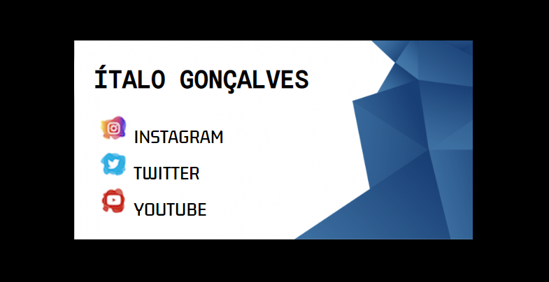

<h1>Cartão de visitas - CSS</h1>

Foi elaborado um simples cartão de visitas, afim de concretizar conhecimentos básicos de CSS, como:

<ul>
  <li>Background</li>
  <li>Box Model</li>
  <li>Fonts</li>
</ul>

